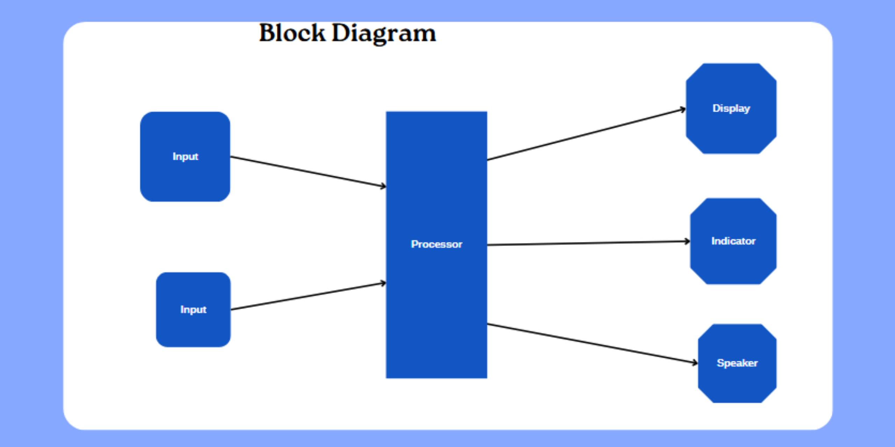

# 🎵 ESP32 Volume Control System & Game  

> 🔊 An IoT system using **ESP32** with potentiometer-based volume control,  
> OLED display visualization, LED brightness mapping, and a fun mini-game mode!  

---

## 🌟 Project Overview  
This project was developed as part of **Computer Engineering coursework (TNI)**.  
It integrates hardware (ESP32, potentiometer, OLED, LED, speaker, button) and software logic for **real-time volume adjustment and interactive game functionality**.  

---

## 🛠 Features  
- Control volume via **Potentiometer** (0–100%)  
- Display current volume % on **OLED (SSD1306 128x64 I2C)**  
- Adjust **LED brightness** using PWM mapping to volume level  
- **Speaker output** dynamically controlled by potentiometer  
- **Game Mode**: Press button 3 times within 7 seconds → 🎉 *You Win!*  

---

## 📂 Repository Contents  
- `main.py` → MicroPython code for ESP32 (PWM, ADC, OLED, Interrupts, Game logic):contentReference[oaicite:0]{index=0}  
- `Presentation file.pdf` → System design, requirements, architecture, and diagrams:contentReference[oaicite:1]{index=1}  

---

## 🚀 How It Works  
1. Connect hardware components: ESP32, potentiometer, OLED, LED, button, speaker.  
2. Flash `main.py` to ESP32 (MicroPython/Thonny IDE).  
3. Rotate potentiometer to change volume → OLED updates & LED brightness changes.  
4. Game Mode: Press the button → If ≥3 presses in 7s → OLED shows **WIN!!**, otherwise **YOU LOSE**.  

---

## 🛠 Hardware Components  
- ESP32 WROOM  
- Potentiometer (Analog input)  
- SSD1306 OLED (128x64 I2C)  
- LED (PWM brightness)  
- Button (interrupt-based input)  
- Speaker (PWM sound output)  

---

## 🔧 System Diagrams  

### 1. Block Diagram  
  

### 2. Circuit Diagram  
  

### 3. Hardware Prototype  
  

---

## 🧑‍💻 Tech Stack  
- **Language:** MicroPython  
- **Libraries:** `machine`, `ssd1306`, `utime`:contentReference[oaicite:2]{index=2}  
- **Concepts:** PWM, ADC, External Interrupts, Mode Switching, Game Logic  

---

## 📌 Learning Outcomes  
- Embedded systems design with ESP32  
- Real-time signal processing (ADC to PWM)  
- OLED visualization and UI feedback  
- Basic game logic implementation on microcontroller  

---

## ❤️ Credits  
Developed by **Nuttamon Chanseeda (Gift)** and Team – Computer Engineering, Thai-Nichi Institute of Technology (TNI)  
